# Organization 생성 및 Fork

## Group 생성

> Repository를 생성하기 전, 함께 작업할 Group(= Organization)을 먼저 생성

* 팀 명, 관리할 계정 주소, 관리자 member 등의 추가 설정을 마침

## Repository 생성

> 생성된 Organization에서 New Repository를 생성

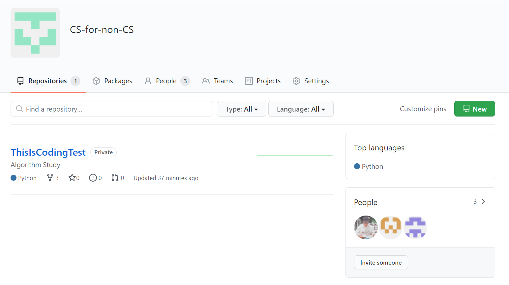

* Repository 명, 관리자 Member, Public or Private 설정

* `git rename origin algo`
  * 관리자하기 위해 선언하는 이름을 origin -> algo로 변경

## Fork 관리

> 그룹 Setting에서 생성된 Repository에 대한 fork 기능 활성화
>
> > [Organization] - [Setting] - [Memger privilege] - [Repository forking]

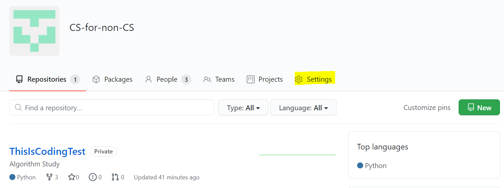

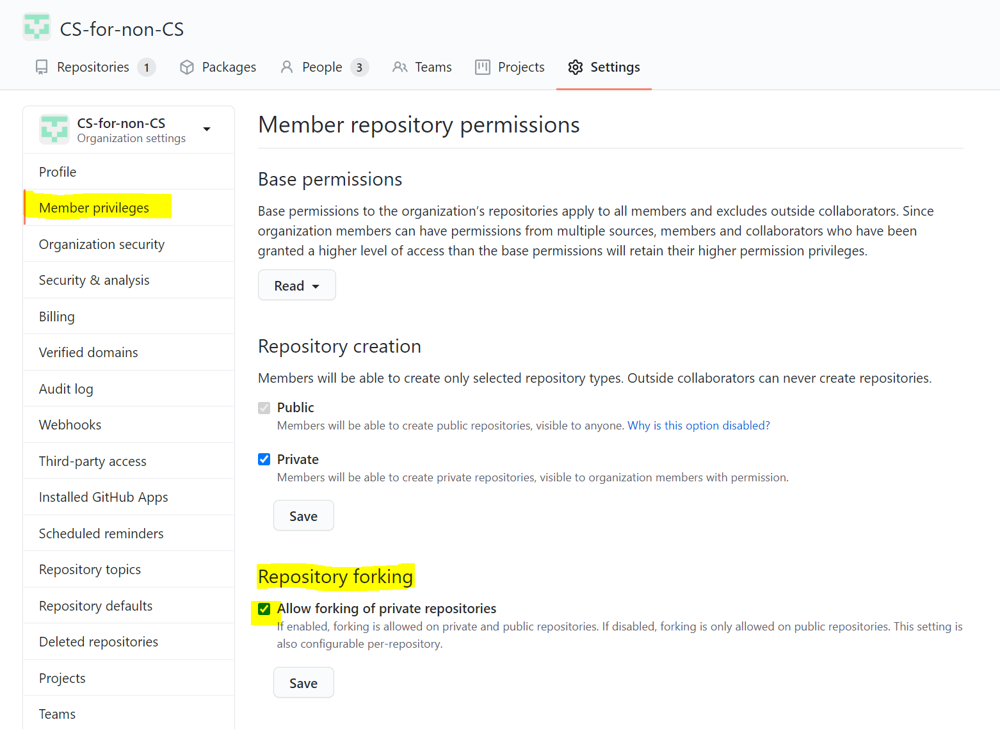

## 나의 Github으로 Fork하기

> 원본 저장소와 Fork를 통해 분리된 작업 공간을 할당시킴

## Local 환경에 Fork 주소 연결(Clone / Remote)

> Local 컴퓨터 환경과 Github Fork 주소를 연결하기

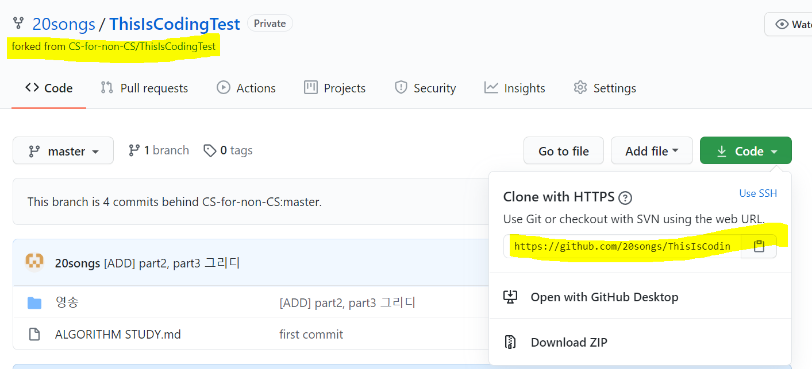

* 아래 두 개의 사항 중 선택하여 시행
  * `git clone [주소]`
  * `git init`
    `git remote add [주소]`

## Local 환경에 원본 주소 연결(Remote)

> 원본 Repository에서 Pull을 받아 동기화 시키기 위한 작업
>
> >  원본 저장소 받아오기

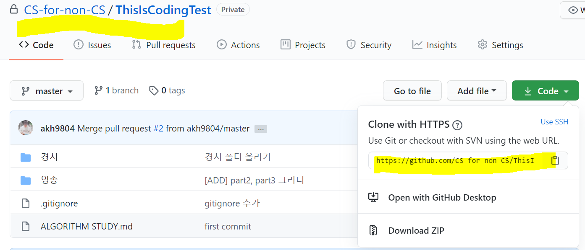

* `git remote -v`를 통해 현재 origin 권한으로 되어 있는 Local 디렉토리 확인
* `git remote add [algo] [주소]`
* `git remote -v`를 통해 확인

## Local 작업 > Fork 동기화

> add - commit - push(origin)

* push 할 때 원본 저장소와 바로 연결지으면 안됨!
  * `git push algo master` 금지!

## Fork 저장소 - 원본 저장소 동기화 (PR)

> Pull Request

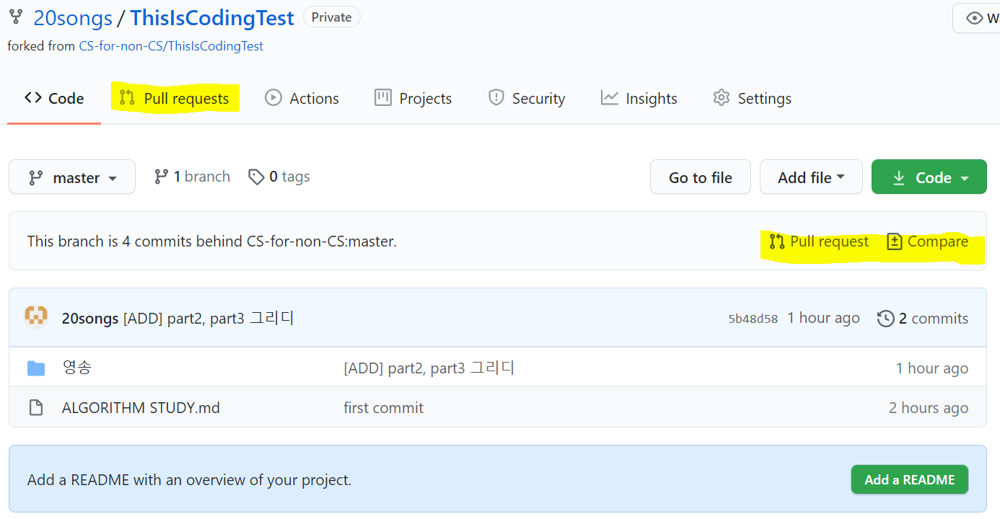

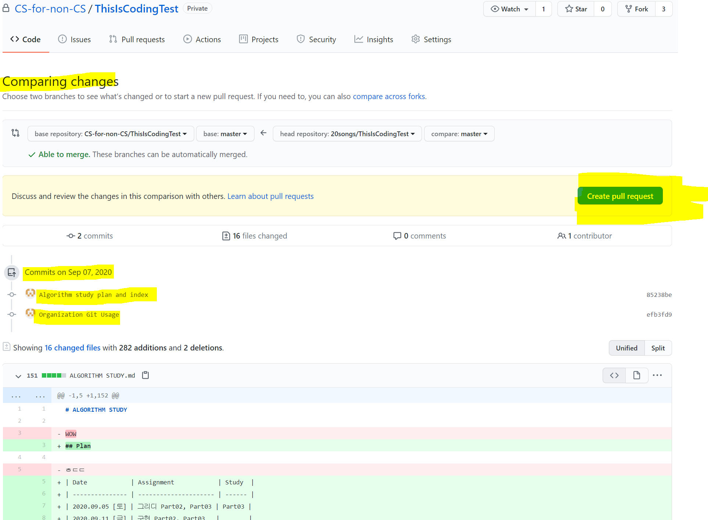

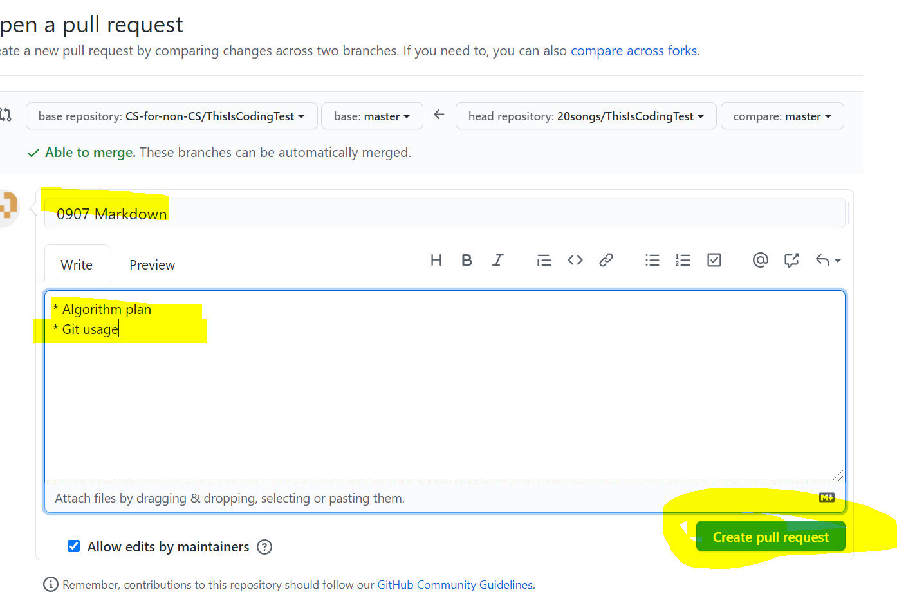

## 원본 저장소 - Fork 반영 (Merge)

> PR 요청을 확인한 후, 변경 내용 점검 후 Merge

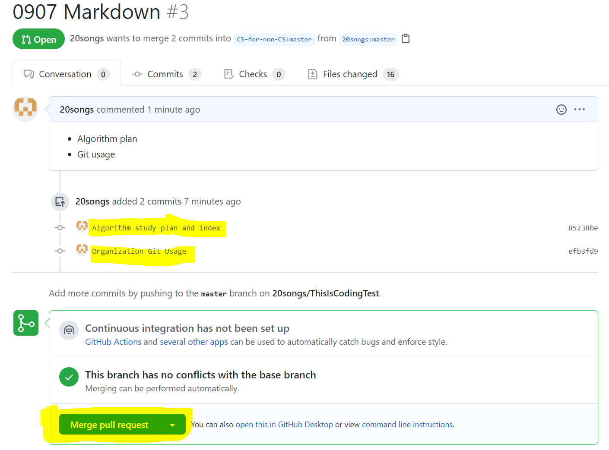

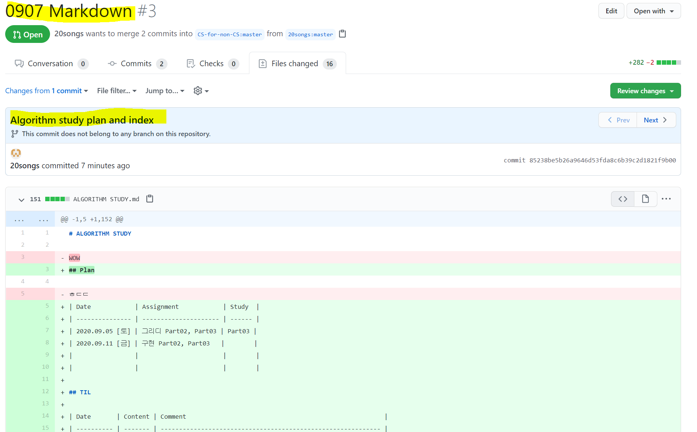

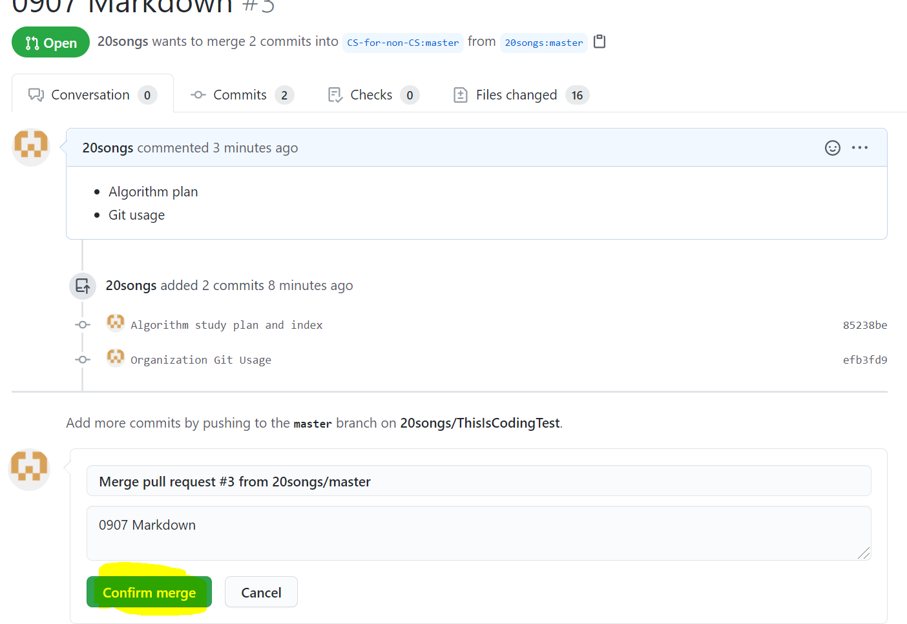

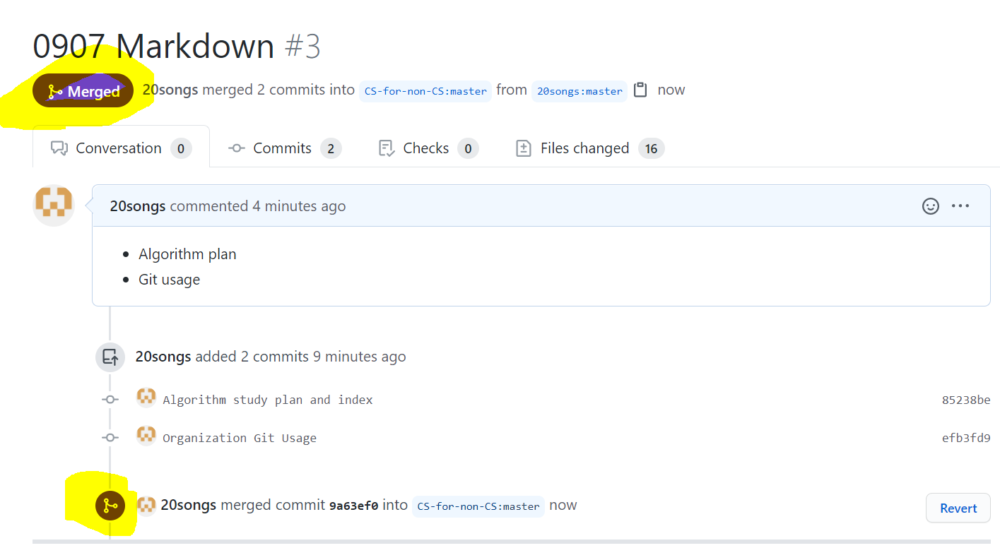

## 원본 저장소 - Local 작업환경 동기화 (Pull)

`git pull algo master`

## 원본 저장소 - Fork 동기화

`git add .`

`git commit -m 'origin repoistory'`

`gir push origin master`